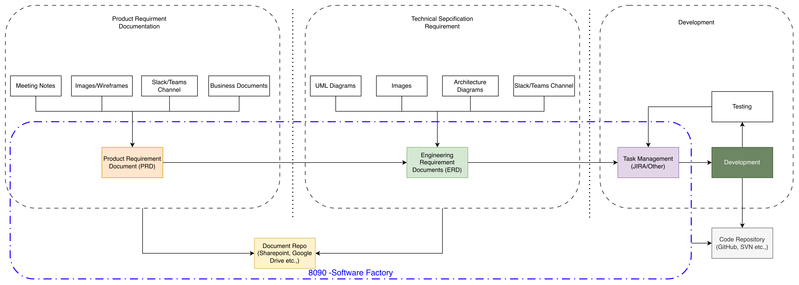
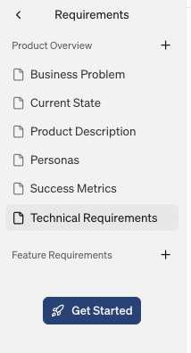
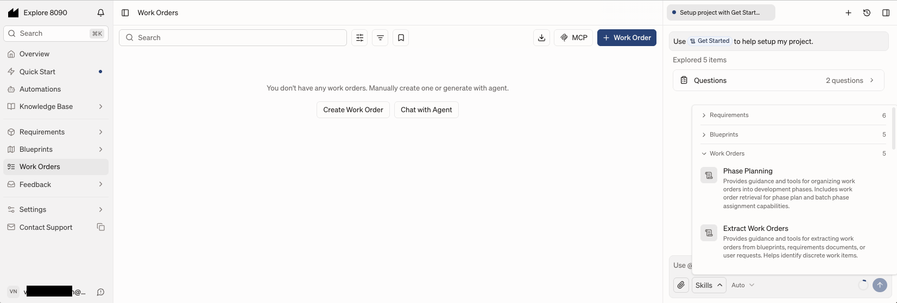
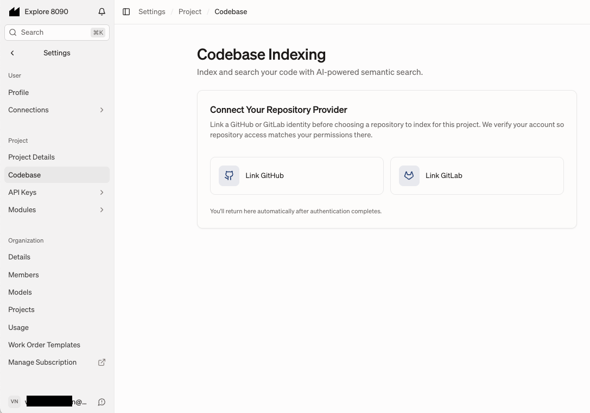
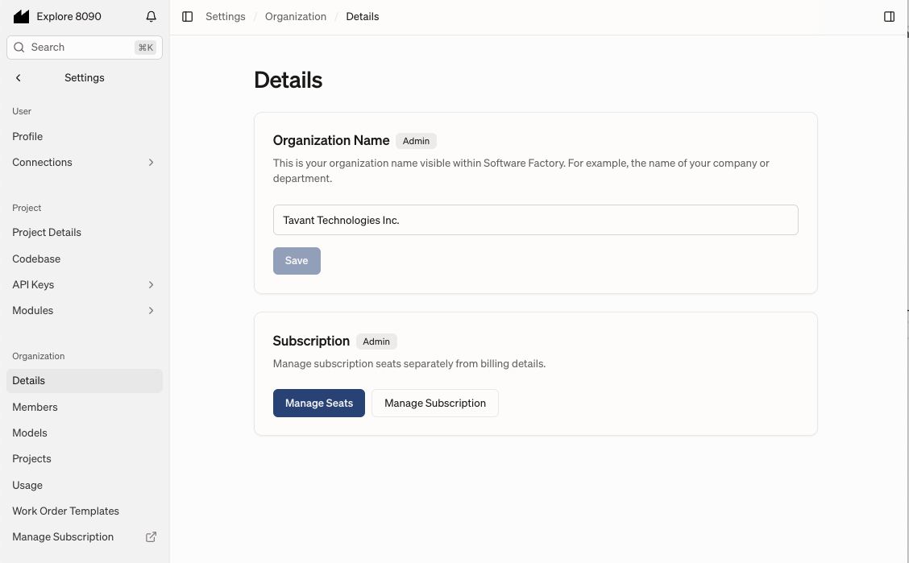
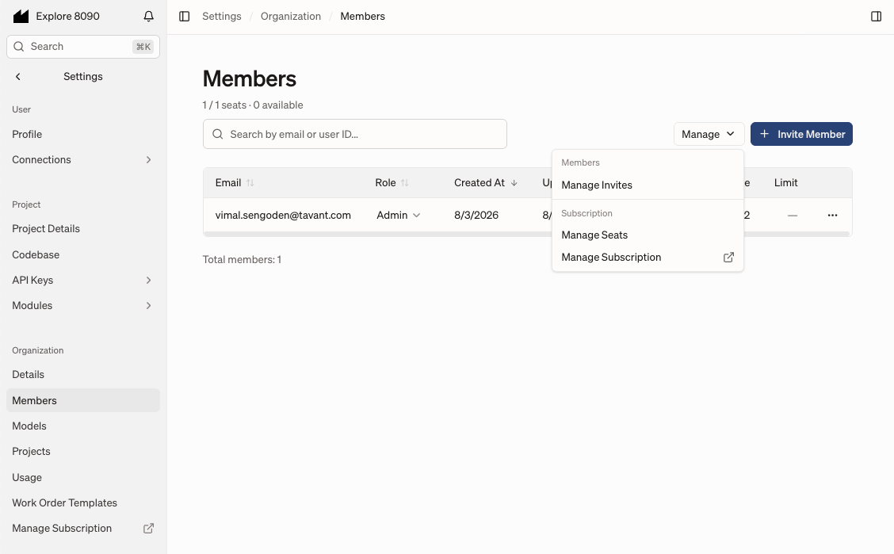
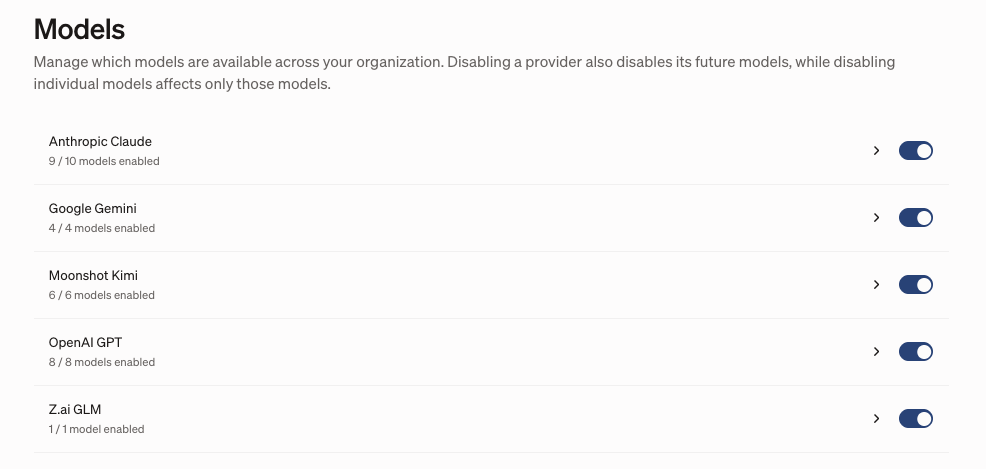
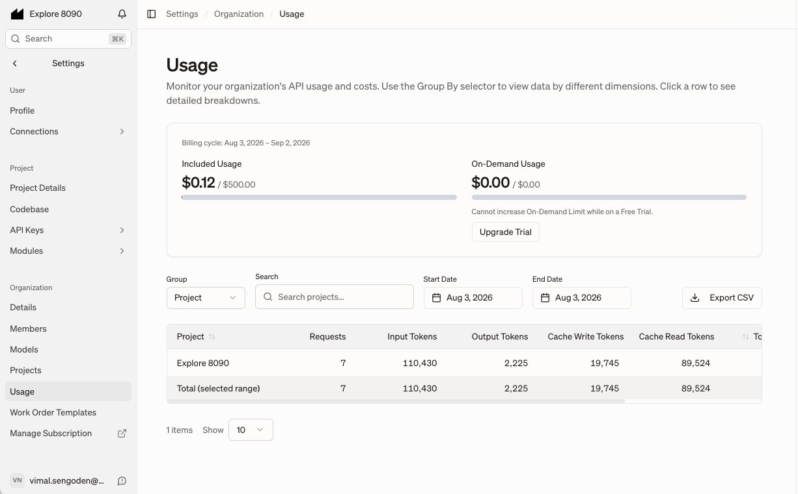
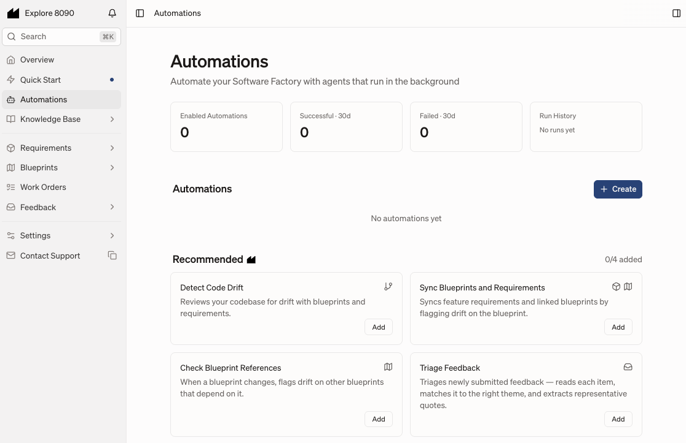

# 8090 - Software Factory - Case Study
8090 is the platform - for AI-native software development control plane.

Software Factory is a product within 8090 platform

## Contents
- [Overview](#overview)
  - [What is 8090 / Software Factory?](#what-is-8090--software-factory)
  - [What problem it solves](#what-problem-it-solves)
  - [What it does not do](#what-it-does-not-do)
- [Software Factory Components](#software-factory-components)
  - [Knowledge Base (Raw Materials)](#knowledge-base-raw-materials)
    - [Artifacts](#artifacts)
    - [Codebase](#codebase)
  - [Module](#module)
    - [Requirements](#requirements)
    - [Blueprints](#blueprints)
    - [Work Orders](#work-orders)
    - [Feedback](#feedback)
- [Knowledge Graph](#knowledge-graph)
- [Two Approaches](#two-approaches)
  - [Forward Engineering](#forward-engineering)
  - [Reverse Engineering](#reverse-engineering)
    - [Migrating from JIRA](#migrating-from-jira)
- [Administration](#administration)
  - [User Management](#user-management)
  - [Project Management](#project-management)
  - [Organization](#organization)
    - [Members/Seats](#membersseats)
    - [Models](#models)
    - [Projects](#projects)
    - [Usage](#usage)
    - [Templates](#templates)
- [Billing](#billing)
- [Capacity](#capacity)
- [Appendix](#appendix)
  - [Automations](#automations)

## Overview

### What is 8090 / Software Factory?
8090 is the platform for AI-native software development control plane. Software Factory is a product within the 8090 platform, with the objective to enforce Quality and Reliability in Software Development using AI.

### What problem it solves
Typical SDLC Process involves the following high-level steps:

 - Product/Feature requirement documentation (PRD) out of various discussions and sources
 - Engineering Requirement document (ERD) out of PRD and technical discussions
 - Task Break down - Epic, User story creation
 - Task/User story development
 - Testing and fixes

Software Factory provides one common, **coordinated** plane for all of the above with specialized Agentic AI helping each step above.

### What it does not do
_Software Factory complements coding agent (This is NOT another coding agent)_

## Software Factory Components
*for any Project execution*
  - [Knowledge Base (Raw Materials)](#knowledge-base-raw-materials)
    - [Artifacts](#artifacts)
    - [Codebase](#codebase)
  - [Module](#module)
    - [Requirements](#requirements)
    - [Blueprints](#blueprints)
    - [Work Orders](#work-orders)
    - [Feedback](#feedback)

Dashboard:

**"Explore 8090"** is the project name

Note: Recent update renamed Artifacts and Codebase to Knowledge Base

Chat Agent Options:

  

### Knowledge Base (Raw Materials)

#### Artifacts
This is to store raw artifacts of the project (MD files, meeting notes, images, audio, video, etc.)

##### For additional info
https://www.8090.ai/docs/raw-materials/artifacts

#### Codebase

Links to external code repository. Software Factory indexes & tracks code repository changes.

##### For additional info
https://www.8090.ai/docs/raw-materials/codebase

### Module
- Requirements
- Blueprints
- Work Orders
- Feedback

_Note: The coding agent and code repository are outside the control plane_

#### Requirements
  *Organize `Requirements as feature tree`*

Generate/Draft PRD using the help of Agent with the following:
 - External documents (meetings notes, slack, images and others) uploaded to `Artifacts`
 - Presets and template provided (feature tree)
 - Plain English prompting
 - Team Collaboration

With Software Factory as the single source of truth for PRD.

Requirement component window is a Markdown Editor with Agent tools around to help

Note: Left navigation listing the structure and 'Get Started' and Agent Prompting to draft the requirement sections

##### For additional info
https://www.8090.ai/docs/opinions/requirements-writing-guide

#### Blueprints
*Technical plans that connect architecture to each feature* 

 Generate/Draft ERD using the help of Agent with the following:
 - External documents (meetings notes, slack, images and others) uploaded to `Artifacts`
 - `Requirements as feature tree`
 - Presets/templates
 - Plain English prompting to generate documentation including UML diagrams and architecture diagrams etc.
 - Team Collaboration

With Software Factory as the single source of truth for ERD.

This follows **C4 Model for "Draw and Explain Architecture"** using four levels of details System Context, Containers and Components

Simplified version of the blueprint writing:

Blueprint component allows defining blueprint/architecture for project using the following:
- Container - Independently deployable unit (Represents C4 Container)
- Components - Reusable components across Containers (C4 Component)
- Feature Blueprints
- Others

Note: Container and Components form a common baseline for defining the features i.e use cases of a software or application

##### For additional info
https://www.8090.ai/docs/opinions/blueprint-writing-guide

#### Work Orders
  *Actionable tasks for your developers. And you can connect your coding agent over MCP to take those on*

  Identify tasks and user stories from ERD and PRD (i.e. `Requirements` & `Blueprints`)
  Create Work Orders and define the order and status for development pick-up

- We can create a Work Order like a task ticket in JIRA and link documentation
- Also use Agent and Skill to extract Work Orders from Requirements

##### For additional info
https://www.8090.ai/docs/modules/work-orders

#### Feedback
  *Capture user feedback and turn it into structured work*
  Interface for user or systems to generate feedback that can turn into Work Orders.

- Manual feedback

  

- Testing tools integration

  

##### For additional info
https://www.8090.ai/docs/modules/feedback

## Knowledge Graph
  Keeps every piece linked to the ones before and after.
  `requirements -> blueprints -> workorders -> code`. Any out-of-sync change is flagged.

8090 AI does not make its platform, knowledge graph, or base structure open source. It is a proprietary enterprise AI orchestration platform and software development control plane

Note from various sources describing how Knowledge Graph and Base and Assets are managed
- Raw assets from customer calls, documents, and designs are processed and mapped into granular elements
- Information is split into specific types—like Product Overview Documents and Feature Requirements Docs (FRDs)—rather than a single bloated PRD
- Relationships between business intent, constraints, and dependencies are dynamically bound together instead of relying on linear context matching
- Cross-references via @mentions link specific requirements, blueprints, and text artifacts together so agents pull relevant subsets rather than full data silos

## Two Approaches

### Forward Engineering
*For new project setup, requirement to code uses the factory components in natural order.*

In a typical SDLC process, the developer picks a task from a Task Management tool (like JIRA) in the IDE, completes the development, and the IDE marks the task complete in the Task Management tool.

With Software Factory, the developer instead picks the task from Work Orders (of Software Factory) using a Coding Agent (like Claude Code) via an MCP Client.

Software Factory MCP Server provides tools with the ability to pull context (Requirements and Blueprints) to complete the task successfully. Once done, the Work Order is marked completed to reflect in Software Factory.

We can build and add additional skills to support SDLC workflow and development

#### For additional info
https://www.8090.ai/docs/opinions/agent-skill

### Reverse Engineering
For an existing `Codebase`, we can connect Software Factory to a Git Repo and create a new project. Then upload available documents to `Artifacts` and work backwards to generate `Requirements` and `Blueprints`.

#### Migrating from JIRA
https://www.8090.ai/docs/opinions/jira-migration

## Administration

### User Management 
Users belong to an Organization (having multiple seats)
- Seats are number of user allowed for that Organization as per the billing

### Project Management
  Configure Templates and Prompts for Agents (Requirements, Blueprints and Work Orders)

### Organization

Administrator can manage and track usage and projects across the platform

#### Members/Seats

#### Models

#### Projects
Organization can have multiple projects.
- Currently I do not see option to control user access to a specific project

#### Usage

#### Templates

## Billing

| Enterprise | Self Serve |
| ---------- | ---------- |
| Starting at $1M/yr | $200 /user/month |
  
**_Tokens billed separately_**

### Model billing
#### For additional info
https://www.8090.ai/docs/administration/usage#model-pricing

The pricing shown above, as well as any additional charges under specific conditions (e.g., conversations exceeding 200k tokens or use of US-hosted endpoints), are sourced from the provider's API.

## Capacity
What is the capacity? 
  - No documented technical limits
  - Number of seats defined through billing for organization
  - Model usage tokens are billed separately

### For additional info
https://www.8090.ai/docs/administration/organizations

## Appendix
### Automations
Set up automations to:
- Detect code drifts
- Sync blueprints and requirements
- Blueprint reference changes
- Triage feedback

