# 8090 - Software Factory
8090 is the platform - for AI-native software development control plane.

Software Factory is a product within 8090 platform

## Overview

Objective is to enforce Quality and Reliability in Software Development using AI

Typical SDLC Process involves the following high-level steps:

 - Product/Feature requirement documentation (PRD) out of various discussions and sources
 - Engineering Requirement document (ERD) out of PRD and technical discussions
 - Task Break down - Epic, User story creation
 - Task/User story development
 - Testing and fixes

Software Factory provides one common, **coordinated** plane for all of the above with specialized Agentic AI helping each step above.

## Software Factory Components

Dashboard:

**"Explore 8090"** is the project name

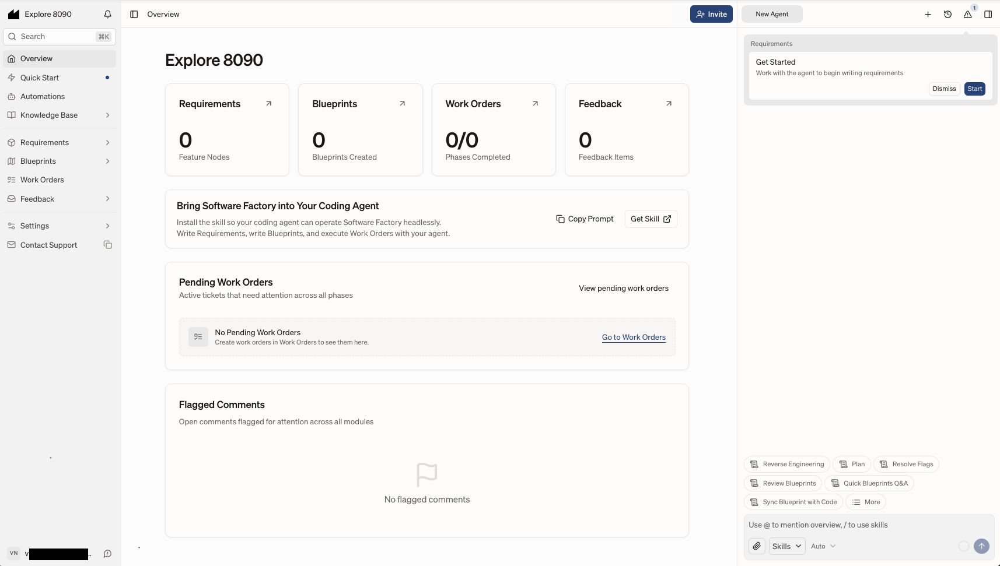
Note: Recent update renamed Artifacts and Codebase to Knowledge Base

Chat Agent Options:

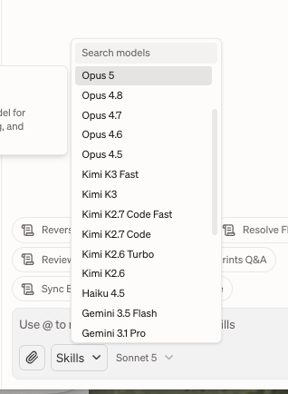 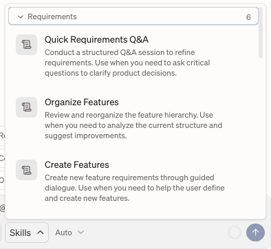 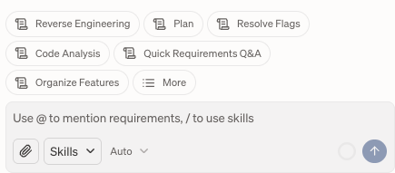

### Common Components (Raw Materials | Knowledge Base)
  - Artifacts| Knowledge Base (MD files, audio, video, etc.)
  https://www.8090.ai/docs/raw-materials/artifacts
  - Codebase
  https://www.8090.ai/docs/raw-materials/codebase

### Process Components (Modules)
- Requirements
- Blueprints
- Workorders
- Feedback

### Software Factory Development Control Plane

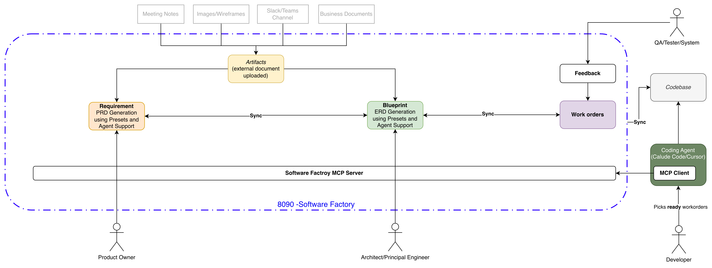

#### Requirement
  *Organize `requirements as feature tree`*

Generate/Draft PRD using the help of Agent with the following:
 - External documents (meetings notes, slack, images and others) uploaded to `Artifacts`
 - Presets and template provided (feature tree)
 - Plain English prompting
 - Team Collaboration

With Software Factory as the single source of truth for PRD.

Requirement component window is a Markdown Editor with Agent tools around to help

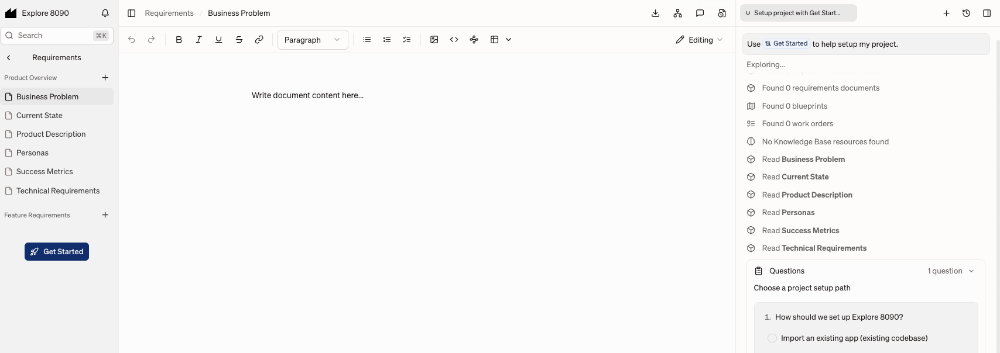

Note: Left navigation listing the structure and 'Get Started' and Agent Prompting to draft the requirement sections

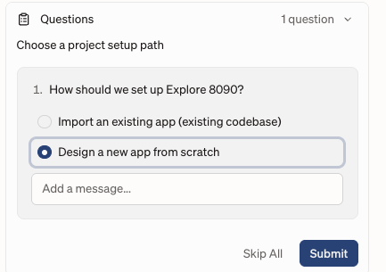

##### For additional info
https://www.8090.ai/docs/opinions/requirements-writing-guide

#### Blueprints
*Technical plans that connect architecture to each feature* 

 Generate/Draft ERD using the help of Agent with the following:
 - External documents (meetings notes, slack, images and others) uploaded to `Artifacts`
 - `Requirements as feature tree`
 - Presets/templates
 - Plain English prompting to generate documentation including UML diagrams and architecture diagrams etc.
 - Team Collaboration

With Software Factory as the single source of truth for ERD.

This follows C4 Model for "Draw and Explain Architecture" using four levels of details System Context, Containers and Components

Simplified version of the blueprint writing:

Blueprint component allows defining blueprint/architecture for project using the following:
- Container - Independently deployable unit (Represents C4 Container)
- Components - Reusable components across Containers (C4 Component)
- Feature Blueprints
- Others

Note: Container and Components forms a common baseline for defining the features i.e use cases of a software or application

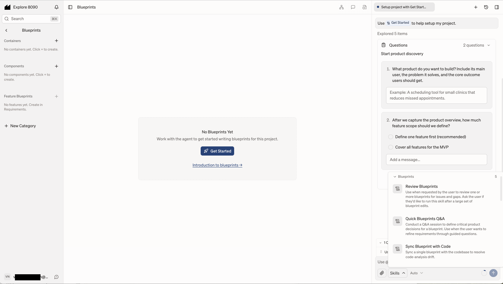

##### For additional info
https://www.8090.ai/docs/opinions/blueprint-writing-guide

#### Workorders
  *Actionable tasks for your developers. And you can connect your coding agent over MCP to take those on*

  Identify tasks and user stories from ERD and PRD (i.e. `Requirement` & `Blueprints`)
  Create work orders and define the order and status for development pick-up

- We can create work order like task ticket in JIRA and link documentation
- Also use Agent and Skill to extract work orders from requirements

##### For additional info
https://www.8090.ai/docs/modules/work-orders

#### Feedback
  *Capture user feedback and turn it into structured work*
  Interface for user or systems to generate feedback that can turn into work orders.

- Manual feedback

  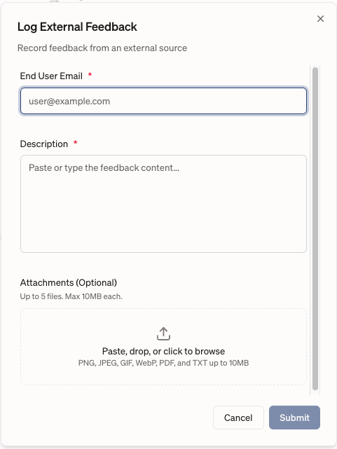

- Testing tools integration

  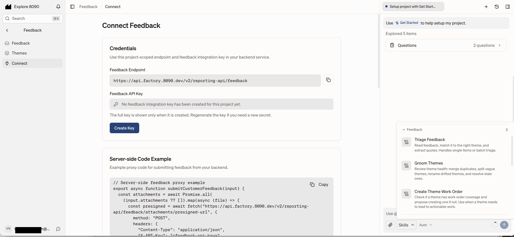

##### For additional info
https://www.8090.ai/docs/modules/feedback

## Knowledge Graph
  Keeps every piece linked to the ones before and after.
  `requirements -> blueprints -> workorders -> code`. Any out-of-sync change is flagged.

8090 AI does not make its platform, knowledge graph, or base structure open source. It is a proprietary enterprise AI orchestration platform and software development control plane

Note from various sources describing how Knowledge Graph and Base and Assets are managed
- Raw assets from customer calls, documents, and designs are processed and mapped into granular elements
- Information is split into specific types—like Product Overview Documents and Feature Requirements Docs (FRDs)—rather than a single bloated PRD
- Relationships between business intent, constraints, and dependencies are dynamically bound together instead of relying on linear context matching
- Cross-references via @mentions link specific requirements, blueprints, and text artifacts together so agents pull relevant subsets rather than full data silos

## Development

Software Factory complements coding agent (This is NOT another coding agent). In a typical SDLC process, the developer picks a task from a Task Management tool (like JIRA) in the IDE, completes the development, and the IDE marks the task complete in the Task Management tool.

*With Software Factory developer will be picking the task from Workorders (of Software Factory) using Coding Agent (like Claude Code) via MCP Client*

Software Factory MCP Server provides tools with the ability to pull context (requirement and blueprints) to complete the task successfully. Once done, the workorder is marked completed to reflect in Software Factory.

We can build and add additional skills to support SDLC workflow and development
https://www.8090.ai/docs/opinions/agent-skill

## Reverse Engineering

For an existing `Codebase`, we can connect Software Factory to a Git Repo and create a new project. Then upload available documents to `Artifacts` and work backwards to generate `Requirements` and `Blueprints`.

## Administration
 
Users belong to an Organization (having multiple seats)
- Seats are number of user allowed for that Organization as per the billing

Organization can have multiple projects
- Currently I do not see option to control user access to a specific project 

Administrator can manage and track usage and projects across the platform

Models:

Work Order Templates:

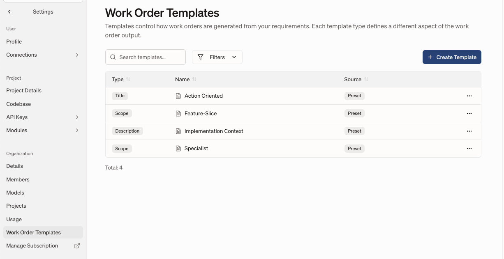

### Billing
  #### Enterprise
  Starting at $1M/yr

  #### Self Serve
  $200 /user/month
  
**Tokens billed separately**

Model billing:

https://www.8090.ai/docs/administration/usage#model-pricing

The pricing shown above, as well as any additional charges under specific conditions (e.g., conversations exceeding 200k tokens or use of US-hosted endpoints), are sourced from the provider’s API 

### Capacity
What is the capacity? 
  - No documented technical limits
  - Number of seats defined through billing for organization
  - Model usage tokens are billed separately

##### For additional info
https://www.8090.ai/docs/administration/organizations

## Migrating from JIRA
https://www.8090.ai/docs/opinions/jira-migration

## Additional Notes:

