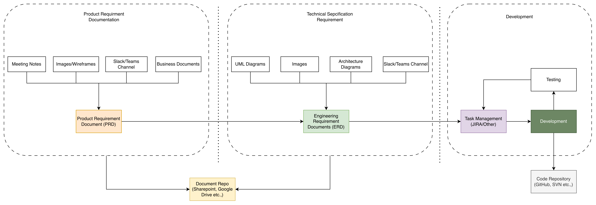

# 8090 - Software Factory
8090 is a platform - for AI-native software development control plane.

Software Factory is product in 8090 platform

## Overview

Objective is to enforce Quality and Reliability in Software Development using AI

Typical SDLC Process involves the following high-level steps:

 - Product/Feature requirement documentation (PRD) out of various discussions and sources
 - Engineering Requirement document (ERD) out of PRD and technical discussions
 - Task Break down - Epic, User story creation
 - Task/User story development
 - Testing and fixes

Software Factory provides one common, **coordinated** plane for all of the above with specialized Agentic AI helping each step above.

## Software Factory Components

### Common Components (Raw Materials)
  - Artifacts (MD files, audio, video, etc.)
  https://www.8090.ai/docs/raw-materials/artifacts
  - Codebase
  https://www.8090.ai/docs/raw-materials/codebase

### Process Components (Modules)
- Requirements
- Blueprints
- Workorders
- Feedback

### Software Factory Development Control Plane

#### Requirement
  *Organize `requirements as feature tree`*

Generate PRD using the help of Agent with the following:
 - External documents (meetings notes, slack, images and others) uploaded to `Artifacts`
 - Presets and template provided (feature tree)
 - Plain English prompting
 - Team Collaboration

With Software Factory as the single source of truth for PRD.

https://www.8090.ai/docs/opinions/requirements-writing-guide

#### Blueprints
*Technical plans that connect architecture to each feature* 

 Generate ERD using the help of Agent with the following:
 - External documents (meetings notes, slack, images and others) uploaded to `Artifacts`
 - `Requirements as feature tree`
 - Presets/templates
 - Plain English prompting to generate documentation including UML diagrams and architecture diagrams etc.
 - Team Collaboration

With Software Factory as the single source of truth for ERD.

https://www.8090.ai/docs/opinions/blueprint-writing-guide

#### Workorders
  *Actionable tasks for your developers. And you can connect your coding agent over MCP to take those on*

  Identify tasks and user stories from ERD and PRD (i.e. `Requirement` & `Blueprints`)
  Create work orders and define the order and status for development pick-up

#### Feedback
  *Capture user feedback and turn it into structured work*
  Interface for user or systems to generate feedback that can turn into work orders.
  - Testing tools integration
  - Manual feedback

https://www.8090.ai/docs/opinions/work-order-writing-guide

## Knowledge Graph
  Keeps every piece linked to the ones before and after.
  `requirements -> blueprints -> workorders -> code`. Any out-of-sync change is flagged.

## Development

Software Factory complements coding agent (This is NOT another coding agent). In a typical SDLC process, the developer picks a task from a Task Management tool (like JIRA) in the IDE, completes the development, and the IDE marks the task complete in the Task Management tool.

*With Software Factory developer will be picking the task from Workorders (of Software Factory) using Coding Agent (like Claude Code) via MCP Client*

Software Factory MCP Server provides tools with the ability to pull context (requirement and blueprints) to complete the task successfully. Once done, the workorder is marked completed to reflect in Software Factory.

https://www.8090.ai/docs/opinions/agent-skill

## Software Factory Agents

- Specialized Agent with tools for Requirement Documentation & Blueprint Documentation
- Allows customization of Presets, System Prompts and Tools

## Reverse Engineering

For an existing `Codebase`, we can connect Software Factory to a Git Repo and create a new project. Then upload available documents to `Artifacts` and work backwards to generate `Requirements` and `Blueprints`.

# Adminisration
https://www.8090.ai/docs/administration/organizations

## Migrating from JIRA
https://www.8090.ai/docs/opinions/jira-migration

1. what is 8090?
2. What is the capacity?
3. User management?
4. Knowledge Base strcuture or how it is strcutre?
5. What is the capactity of the SF?

